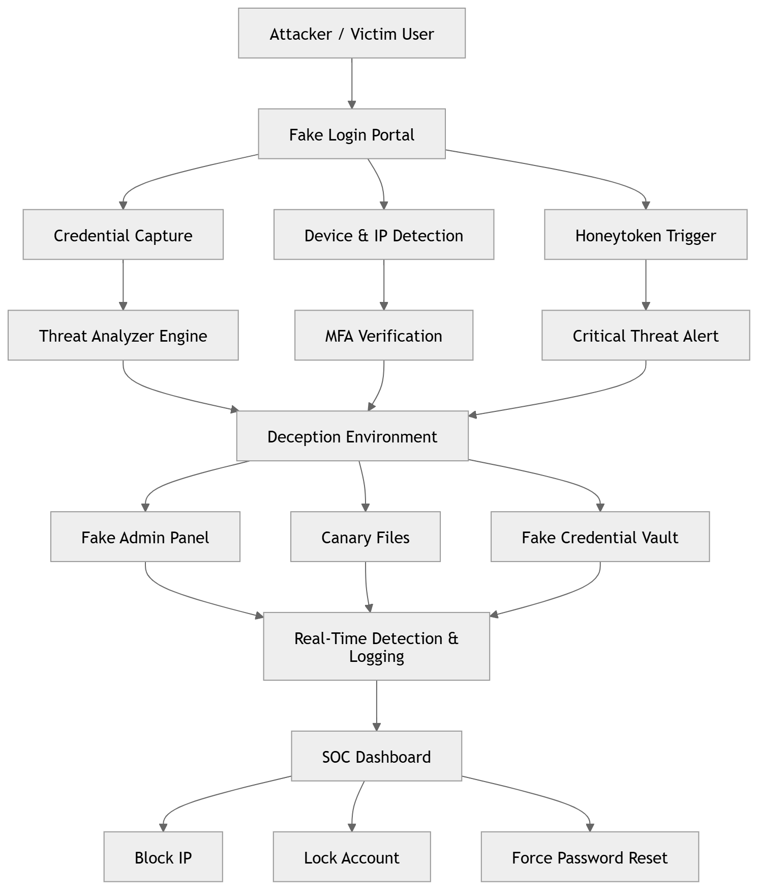
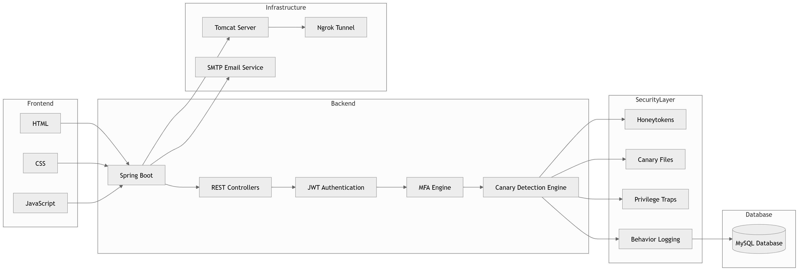
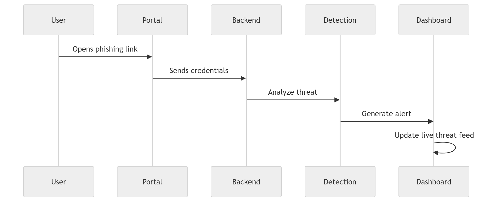
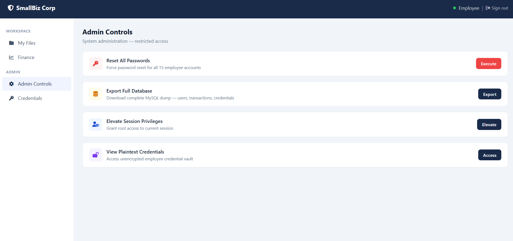
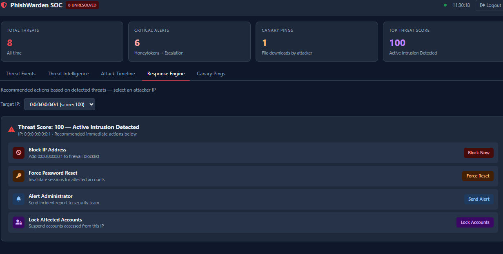

<p align="center">
  
  
  
  
</p>

<h1 align="center">🛡️ PhishWarden</h1>

<p align="center">
Deception-Based Authentication Security System
</p>

<p align="center">
"We don’t block attackers. We let them in — into a trap."
</p>

---

# 🚀 Overview

**PhishWarden** is a deception-driven cybersecurity system designed specifically for small businesses.

Instead of relying solely on traditional prevention-based security, PhishWarden creates a controlled deception environment that traps attackers, monitors malicious behavior, and protects real assets before damage occurs.

The system focuses on:
- Phishing attack detection
- Credential misuse detection
- Honeypot-based deception
- Real-time attacker monitoring
- Threat intelligence logging

---

# ❗ The Problem

Small businesses are among the most targeted yet least protected organizations against cyber attacks.

## Major Threats

### 🎣 Phishing Attacks
- Fake login pages steal employee credentials
- Attackers gain unauthorized access

### 🔒 Ransomware
- Sensitive files become encrypted
- Businesses risk data loss and downtime

Traditional security systems often fail because:

> Human error remains the weakest security layer.

---

# 💡 The Solution: Deception Over Prevention

PhishWarden introduces a deception-first security model.

Instead of simply blocking attackers:

> The system intentionally redirects suspicious actors into a monitored fake environment.

Inside this environment:
- Every action is tracked
- Every interaction is logged
- Every attempt generates intelligence

Attackers believe they have succeeded.

In reality, they are isolated inside a controlled honeypot system.

---

# 🧠 How It Works

## 🎭 Honeytokens (Bulk Attack Detection)

- Fake high-value credentials are strategically planted
- Example: `admin@company.com`
- Credential usage immediately triggers alerts

Captured Information:
- IP Address
- Browser & Operating System
- Timestamp
- Device Information

---

## 🔐 MFA on Unknown Devices

- Detects suspicious login locations/devices
- Sends OTP verification to the legitimate user

If attacker:
- Fails OTP → Access blocked
- Exceeds attempts → IP blacklisted

---

## 🕵️ Canary Files & Privilege Traps

Inside the deception environment:

- Fake payroll files
- Fake admin panels
- Fake credential vaults

Any interaction triggers:
- Real-time alerts
- Threat analysis
- Canary tracking
- Activity logging

---

# 🏗️ System Architecture

## 🔄 Attack Detection Flow

This diagram demonstrates how phishing activity moves through the detection pipeline and generates live threat alerts.



---

## 🧩 Backend & Security Architecture

The backend architecture of PhishWarden including Spring Boot services, MFA engine, deception layer, and logging system.



---

## 🎯 Deception Workflow

Illustrates how attackers are redirected into a controlled deception environment where all actions are monitored and logged in real-time.



---

# 📊 SOC Dashboard

The Security Operations Dashboard provides real-time visibility into attacker activity.

## Dashboard Features

- 📍 IP tracking
- ⚠️ Threat severity monitoring
- 📈 Dynamic threat scoring
- 🕒 Attack timeline analysis
- 🚫 One-click IP blocking
- 🔒 Account lockdown controls
- 🔑 Forced password reset system

---

# 🎯 Why PhishWarden Matters

Traditional security systems are reactive.

PhishWarden is proactive through deception.

| Attacker Action | What They Think | What Actually Happens |
|----------------|----------------|----------------------|
| Login success | Access granted | Entered honeypot |
| Download file | Retrieved sensitive data | Triggered canary alert |
| Access admin panel | Gained control | Activity logged |

> Every attacker interaction strengthens the defense system.

---

# 🌍 Real-World Inspiration

PhishWarden is inspired by enterprise deception-security systems such as:

- Thinkst Canary
- Honeypot Security Models
- Threat Intelligence Platforms

The goal is to bring enterprise-grade deception security to:

> 💼 Small businesses in a lightweight and affordable form.

---

# 📸 Screenshots

## SOC Dashboard



---

## Threat Detection Panel



---

# 🛠️ Tech Stack

| Layer | Technology |
|------|-------------|
| Backend | Java, Spring Boot |
| Frontend | HTML, CSS, JavaScript |
| Database | MySQL |
| Server | Apache Tomcat |
| Security | Honeytokens, MFA, Canary Files |

---

# ✨ Core Features

| Feature | Description |
|---------|-------------|
| Honeytokens | Detect credential misuse |
| MFA Protection | Blocks suspicious logins |
| Canary Files | Tracks attacker interaction |
| Threat Scoring | Dynamic attack analysis |
| SOC Dashboard | Real-time monitoring |
| Real-Time Alerts | Detects malicious activity instantly |

---

# 🏛️ Repository Structure

```text
PhishWarden/
│
├── database/
├── docs/
├── screenshots/
├── src/
│
├── .gitignore
├── pom.xml
├── README.md
├── mvnw
└── mvnw.cmd
```

---

# ⚙️ Setup & Installation

## Clone Repository

```bash
git clone https://github.com/bhaveshh07/PhishWarden.git
```

---

## Navigate To Project

```bash
cd PhishWarden
```

---

## Run Spring Boot Application

```bash
mvn spring-boot:run
```

---

# 📌 Future Enhancements

- AI-based threat scoring
- Automated response engine
- Integration with SIEM platforms
- Real-time email notifications
- Threat intelligence dashboard
- Browser extension support

---

# 🤝 Contributors

This project was built through collaborative effort and shared vision.

| Contributor | Role |
|-------------|------|
| Bhavesh Pahuja | Core Idea, Security Architecture |
| Tanisha Soni | Database Design & Backend Development |
| Kshitiz Tiwari | Frontend Development & SOC Dashboard |
| Prashant Dubey | Testing & System Validation |

---

# 📄 License

This project is licensed under the MIT License.

---

# 🧩 Final Thought

> "The attacker’s biggest weakness is their confidence."

PhishWarden turns that weakness into a defensive advantage.

---

# ⭐ Support

If you found this project interesting, consider giving it a star ⭐ on GitHub.
